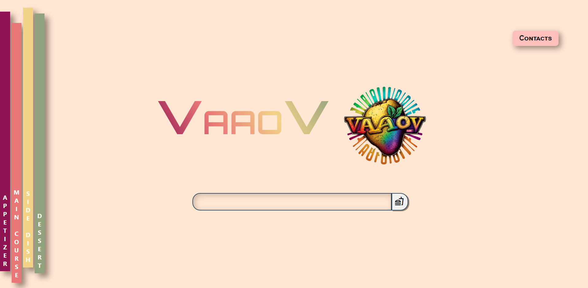
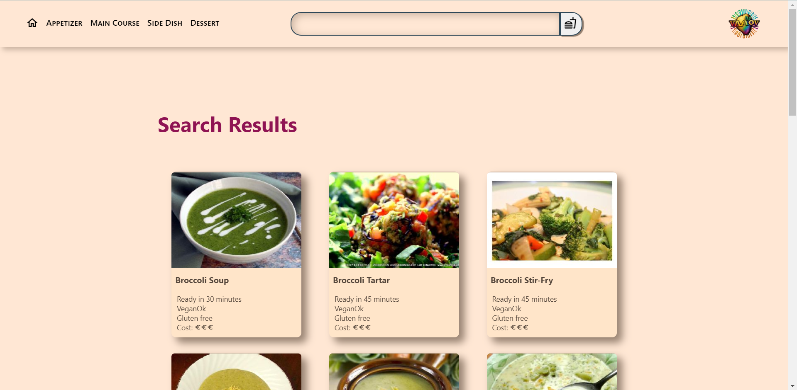
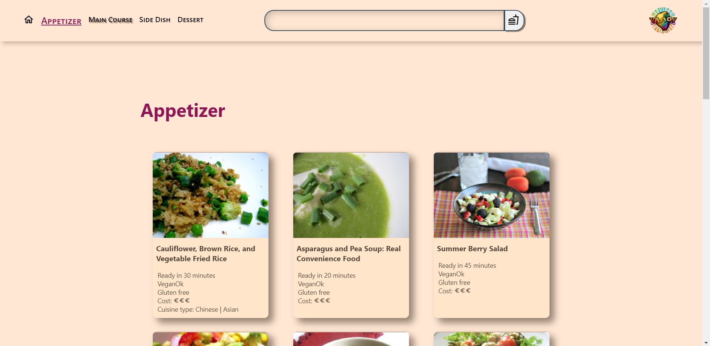

# VaaoV

<strong>VaaoV - VegetVegan way to coocking</strong> is a web app that allows us to search and find multiple solution for our meals.

In the middle we can find a search bar where we can enter keywords and start searches for all kinds of vegan recipes.

On the left, however, we find a scrolling menu that is activated by hovering over it with the mouse cursor. This allows you to find suggestions for various meals for the day.

After starting the search via the text area on the homepage (or after clicking on one of the containers on the main menu) you will navigate to the results page.

Through the header of this section, it will be easy to navigate from one section to another or start another search by entering the key ingredient of your recipe.

The remaining part of the body will display cards with image and minimal information about the recipe.

The recipe instructions section will display the header with the same functions as in the previous section, and in the body of the page, below the recipe photo, the necessary ingredients and the various steps the recipe requires will be explained.
Each Step will require different equipments and ingredients, which will be indicated in the corresponding Step.

## Built With

  REACT

## Try it

  

<h3 align="center">VaaoV - VegetVegan way to coocking</h3>

  

    <a href="https://vaaov-vegan-site.netlify.app/"><strong>LET'S COOK! »</strong></a>

